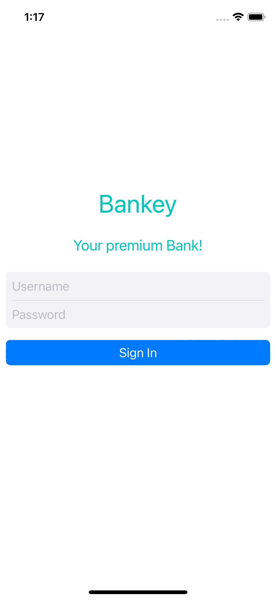

# Bankey
## What will be in the application
- [x] Login Screen
[] Onboarding
[] Home Screen
[] Summary Screen
[] Detail Screen
[] Contact Screen

### Login Screen
- [x] No story boards
    * Build Programmatically
    * Code Snippets
    * Named parameters, Argument Labels
    * Assertion Failures
- [x] Auto Layout
    * intrinsic content size
    * Constraints
    * Best practices
- [x] Colors
    - System colors, Dark Mode
- [x] Dynamic Fonts
    -  Scalable fonts
- [x] UIButton / UILabel / UITextField
    - Activity indicator
- [x] Git Commands
    - git log
    - git status
    - git add
    - git commit
    - git push
    - git clone

